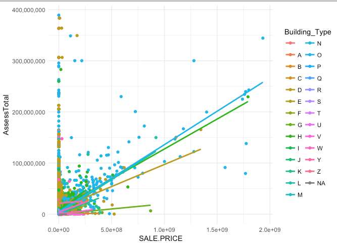

NYC makes the following data sets available for public use:
-[PLUTO](https://www1.nyc.gov/site/planning/data-maps/open-data/dwn-pluto-mappluto.page) contains tax-lot information, including the city's assessed market value of each property (for taxation purposes)
-[Rolling Sales Data](http://www1.nyc.gov/site/finance/taxes/property-rolling-sales-data.page) contains property transactions and sale prices

Marrying these two sources, we can quickly determine if the `Market Value` of a property (i.e., the Assessment Value) correlates at all with the `Sale Price`. What we find is that certain property classes are more homogeneous than others. For example, Office buildings have a stronger correlation than Hotels. Overall, however, the market price rarely seems to track the sale price. 

```{r setup, include=T, message=FALSE, warning=FALSE}
library(tidyverse)
library(modelr)
library(purrr)

knitr::opts_chunk$set(
	echo = TRUE,
	message = FALSE,
	warning = FALSE,
	fig.width = 10,
	fig.height = 8
)
```


For this modeling exercise, the data has already been downloaded and joined:

```{r load data, message=FALSE, warning=FALSE}
sale_augmented <- read_rds("data/sales_augmented.rds")
```


# A Case Example
We will look at a specific case, 31 West 27th Street, to guide the discussion. This office building appears in the sales data 4 times in 10 years.


A couple convenience functions for quickly glimpsing our example property:
```{r convinicence functions}
lookat <- function(boro= 1,blck = 829,lt = 16, data = sale_augmented) {
  data %>% 
    filter(BOROUGH == boro, BLOCK == blck, LOT == lt) %>% 
    arrange(desc(SALE_DATE)) %>% 
    glimpse()
  }

lookhead <- function(boro= 1,blck = 829,lt = 16, data = sale_augmented) {
  data %>% 
    filter(BOROUGH == boro, BLOCK == blck, LOT == lt)
}

lookat()
```

From 2006 to 2014, `SALE.PRICE` increases from `$31,500,000` to `$80,775,000`, a 265% increase. In roughly the same period, `AssessTotal` went from `$5,220,000` (in 2009) to `$12,874,950`, a similar increase.

Let's look at price as a multiple of the Assessed Value: 

```{r motivating example}
sale_augmented %>% filter(BOROUGH == 1, BLOCK == 829, LOT == 16) %>% 
  select(ADDRESS,SALE_DATE, SALE.PRICE, AssessTotal) %>% 
  mutate(SalePriceToAssesstmentRatio = SALE.PRICE/AssessTotal)
```

Is this a consistent pattern across all the sales data?

```{r histogram of ratios}
sale_augmented %>% 
  select(ADDRESS,SALE_DATE, SALE.PRICE, AssessTotal) %>% 
  mutate(SalePriceToAssesstmentRatio = SALE.PRICE/AssessTotal) %>% 
  filter(!is.na(SalePriceToAssesstmentRatio), !is.infinite(SalePriceToAssesstmentRatio)) %>% 
  mutate(Ratio_bin = ntile(SalePriceToAssesstmentRatio,5)) %>% 
  group_by(Ratio_bin) %>% 
  summarise(average_ratio = mean(SalePriceToAssesstmentRatio)) %>% 
  ggplot()+
  aes(x = Ratio_bin, y = average_ratio)+
  geom_col()+
  theme_minimal()+
  labs(title = "Sale Price To Assesstment Ratio")
  

```

In many instances, the ratio is wildly off. This begs the question: which types of buildings are more homogeneous?


```{r geom smooth by group, eval=FALSE, message=FALSE, warning=FALSE, include=T}
sale_augmented %>% 
  select(ADDRESS,SALE_DATE,Building_Type, SALE.PRICE, AssessTotal) %>% 
  mutate(SalePriceToAssesstmentRatio = SALE.PRICE/AssessTotal) %>% 
  filter(!is.na(SalePriceToAssesstmentRatio)) %>% 
  filter(AssessTotal<500000000) %>% 
  #filter(SALE.PRICE>5e+07) %>% 
  ggplot()+
  aes(x = SALE.PRICE, y=AssessTotal, group = Building_Type, color = Building_Type)+
  geom_point()+
  geom_smooth(se=F, method = "lm")+
  scale_y_continuous(labels=scales::comma)+
  theme_minimal()
```




The building designations can be looked up in the [PLUTO Data Dictionary Appendix C](https://www1.nyc.gov/assets/planning/download/pdf/data-maps/open-data/pluto_datadictionary.pdf?r=16v2)

A few of the building classes stand out. For example, "O" stands for 'Office'. In addition, "H" Hotels and "I" Hospitals seem to correlate more than other classes. 

# Modleing

We will fit a simple linear model to each building class using the nested `modelr` approach. 

```{r overall model}
library(modelr)

f1 <- lm(AssessTotal~SALE.PRICE, data = sale_augmented)
summary(f1)
```

Clearly the overall model does not fair well with an Adj R Squared sub 0.2, but what about individual classes?


```{r helper functions}
# helpfer functions for modeling with groups:
group_model <- function(df) {
  lm(AssessTotal ~ SALE.PRICE, data = df)
}

extract_coef <- function(model) coef(model)["SALE.PRICE"]
```


First we nest the data frames by category:
```{r create nested dataframe}
by_group<-
  sale_augmented %>% 
  select(ADDRESS,SALE_DATE,Building_Type, SALE.PRICE, AssessTotal) %>% 
  mutate(SalePriceToAssesstmentRatio = SALE.PRICE/AssessTotal) %>% 
  filter(!is.na(SalePriceToAssesstmentRatio)) %>% 
  group_by(Building_Type) %>% 
  nest()

by_group
```


Next, using `purrr::map` and `broom::glance` we can apply various functions over the nested data frames in order to fit models and extract summary statistics:

```{r show models}

by_group %>% 
  mutate(Number_of_Sales = map_dbl(data,nrow)) %>% 
  mutate(model = map(data, group_model)) %>% 
  mutate(Sale_Coef = map_dbl(model,extract_coef)) %>% 
  mutate(glance = map(model, broom::glance)) %>% 
  unnest(glance) %>% 
  arrange(-adj.r.squared) %>% 
  filter(p.value <= (0.05)) %>% 
  glimpse()

```

The top building classes are:
```{r final table, echo=FALSE, message=FALSE, warning=FALSE}
knitr::kable(
  tribble(
    ~Class, ~Name
    ,"L","Lofts (a type of office)"
    ,"O","Office"
    ,"N","Asylums"
    ,"H","Hotel"
    ,"F","Factory/Industrial"
  )
)
  
```

The very highest adjusted R-Squared achieved with a linear model is 0.35 across the "Lofts Office" group, followed closely by general "Office". The coefficients for these classes are quite low: `0.13`. With more advanced modeling and residual analysis, these models could be improved dramatically, especially for the office classes.  


